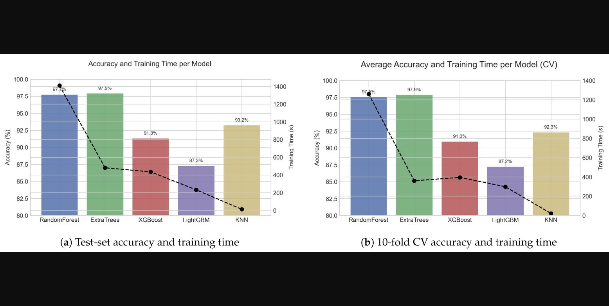

# Machine Learning Models for Reliable Gait Phase Detection Using Lower-Limb Wearable Sensor Data

| 항목 | 내용 |
|------|------|
| 저자 | Muhammad Fiaz, Rosita Guido, Domenico Conforti |
| 소속 | DeHealthLab, University of Calabria (Italy) |
| 출처 | [DOI: 10.3390/app16031397](https://doi.org/10.3390/app16031397) · [MDPI](https://www.mdpi.com/2076-3417/16/3/1397) |
| 학회/연도 | Applied Sciences, 2026, 16(3), 1397 (Special Issue: AI in Healthcare and Precision Medicine 2nd Ed.) |
| 읽은 날짜 | 2026-08-25 |
| 상태 | presented (2026-09-09 WalkAI 발제) |
| 분야 | Machine Learning / Gait Phase Detection / Wearable Sensors |

## 한 줄 요약

공개 하지 다중센서 데이터셋(Zafar et al., 6명)의 오른쪽 다리 23채널을 128샘플 윈도우로 잘라 2944차원 벡터로 펼친 뒤, 자동 relabeling 파이프라인(HS/TO 검출 + 적응 임계값 + 센서 융합)으로 stance / swing / mid-swing 라벨을 만들고 고전 ML 5종(RF, Extra Trees, kNN, XGBoost, LightGBM)을 동일 조건에서 벤치마크 — Extra Trees가 97.9%로 최고, 단 윈도우 단위 분할이라 낙관적 수치임을 저자 스스로 인정.

## 핵심 기여

1. **자동 보행 위상 relabeling 파이프라인** — 원 데이터셋에 위상 라벨이 없어서 직접 생성. 발 스위치(heel/toe 버튼)로 HS/TO 1차 추정 → 버튼 바운스 보정을 위해 flex 센서 아날로그 신호를 [0,1] 정규화하고 0.10~0.90 그리드에서 버튼 이벤트와 시간차가 최소인 임계값 자동 선택(대개 0.2~0.4) → HS~TO = stance, TO~mid-swing = swing, swing 구간 중앙 20~25% = mid-swing
2. **동일 파이프라인 위의 통제 비교** — 전처리·튜닝·평가를 통일해서 성능 차이를 분류기 자체에 귀속. 80/20 층화 분할 + 층화 10-fold CV, 지표는 Acc/Prec/Rec/F1/MCC (불균형 고려해 MCC를 주지표로)
3. **결과: 배깅 앙상블 > kNN > 부스팅** — 테스트셋 기준 Extra Trees 97.91% (MCC 0.968), RF 97.73%, kNN 93.23%(학습 12.8초로 가장 빠름), XGBoost·LightGBM은 더 느리고 정확도도 낮음. 10-fold CV도 동일 순위. 오류는 거의 전부 swing ↔ mid-swing 사이에 집중

## 구조 미리보기 (읽을 때 지도)

- **§2 문헌**: Farah & Baddour(허벅지 IMU 하나 + 결정트리 97.5%), Pazar/Nazari(섬유 스트레인 센서 + RF), Khamparia(FoG 감지 RF 98.9%), Pasinetti(깊이 카메라 + 수정 RF 87.3%) — 대부분 "트리 계열이 이긴다"는 결론
- **§3 데이터**: figshare 공개셋, 6명(건강 5 + 재활 1), 실내외 전·후진 보행. 양측 50채널(다리당 25) 중 오른쪽 23채널만 사용 — sEMG 4(ST/VL/SOL/TA), IMU 2(허벅지·정강이), 관절각 인코더 2(무릎·발목), FlexiForce 2(뒤꿈치·발끝), 발 스위치. 100 Hz, per-subject z-score
- **§3.1.2 윈도잉**: L=128 (1.28초, 한 보행주기 커버), 50% overlap(stride 64), 윈도우 라벨은 지배 위상, 전이/혼합 라벨 윈도우는 **제거**
- **§3.2~3.3 모델**: 트리 계열은 스케일링 없이, kNN만 StandardScaler. 클래스 가중치는 트리 계열에만 역빈도 적용. 하이퍼파라미터는 Table 5(탐색 범위)·Table 7(최종)
- **§4.4 Discussion / §4.7 Limitations**: 저자가 솔직하게 나열 — ① 50% overlap 윈도우를 윈도우 단위로 섞어 나눴으니 인접 윈도우가 train/test에 갈라져 들어감 → 낙관적 ② 6명, 실험실 환경 ③ 오른쪽 다리만 → 좌우 비대칭 분석 불가 ④ 전이 윈도우 제거 → 실제 배포보다 쉬운 문제 ⑤ 시계열/DL 모델과 비교 없음. 향후 LOSO(leave-one-subject-out) 필수라고 명시
- **§4.6**: 마이크로도플러 레이더와의 비교 — 레이더는 비접촉이지만 위상 세분화보다 활동 인식·개인 식별용, 폐루프 제어엔 착용형이 맞다

## 눈여겨볼 포인트

- **제목의 "Reliable"은 라벨 신뢰성을 뜻함** — 모델의 일반화 신뢰성이 아니라, 버튼+flex 융합으로 ground truth를 안정적으로 만든 것이 실질 기여. 모델 벤치마크 자체는 평이함
- 특징 추출이 사실상 없음: 서론에는 "40개 특징(mean/std/min/max/RMS)"이라 써놓고 본문 방법은 **raw 윈도우 flatten(128×23=2944)** — 서론과 방법이 불일치. 실제로는 flatten 버전이 실험된 것으로 보임
- 부스팅이 배깅에 진 이유로 "고차원 노이즈 특징에 민감 + 튜닝 예산 제한"을 들지만, 2944차원 중복 특징에 부스팅이 불리하다는 건 설득력이 약하고 튜닝 부족 가능성이 큼
- 정확도 97.9%는 **동일 피험자·인접 윈도우 누수** 조건의 상한선 — 저자도 결론에서 "upper performance bound"라고 표현. LOSO로 다시 돌리면 크게 떨어질 가능성 높음
- swing ↔ mid-swing 혼동은 구조적: mid-swing을 swing 구간 "중앙 20~25%"로 임의 정의했으니 경계가 애초에 모호
- 서베이 노트(2026-08-18)와의 연결: 서베이가 말한 "보행 위상 인식(이산) → 외골격·의족 제어" 응용에 정확히 해당하고, "임상 보행 데이터 절대량 부족"(6명) 문제가 그대로 재현됨

## 한줄평

DL 없이 트리 앙상블만으로 3위상 분류 97%라는 숫자를 내지만 평가 프로토콜이 관대해서 숫자보다는 **relabeling 파이프라인(버튼+flex 적응 임계값)과 저자가 정리한 한계 목록**이 재사용 가치가 있다 — 우리가 IMU 보행 위상 과제를 한다면 이 논문의 세팅을 LOSO로 재현해서 "진짜 일반화 성능"을 보는 것이 자연스러운 첫 실험.

---

# 정독 리뷰

## 문제 정의

**이산 보행 위상 인식(discrete gait-phase detection)**: 연속 센서 신호를 stance / swing / (mid-swing) 같은 구간으로 나누는 문제. 의족·외골격은 위상에 맞춰 토크를 내야 하므로 위상 오검출 = 안전 문제이고, 재활 모니터링에서는 위상 타이밍이 회복 지표가 된다.

왜 어려운가:
- **라벨이 없다** — 대부분의 착용형 데이터셋은 원신호만 있고 위상 라벨은 연구자가 직접 만들어야 함. 발 스위치는 기계적 바운스·지연 해제, 압력 센서는 드리프트, IMU는 피험자 간 편차가 있어 어떤 하나로 ground truth를 잡기 어려움
- 규칙 기반(자이로/압력 임계값)은 빠르지만 센서 위치·개인차에 약함
- 현대 앙상블 모델들(RF·ET·XGB·LGBM)을 **같은 조건에서** 비교한 연구가 드묾

저자가 정한 문제 범위: 6명 공개 데이터셋, 오른쪽 다리 23채널, 3위상, 고전 ML만.

## 선행 연구 대비

| 연구 | 센서 | 최고 모델 | 성능 | 이 논문과의 차이 |
|------|------|-----------|------|------------------|
| Farah & Baddour [27] | 허벅지 IMU 1개 (kinematics) | 결정트리 J48 | 97.5% | 단일 센서 최소 구성, 본 논문은 다중센서 23채널 |
| Pazar [29] / Nazari [30] | 섬유 스트레인 센서(발목 보조기) | RF | 95.49% | 저속 보행·소규모 데이터 |
| Khamparia [31] | 엉덩이·다리 가속도 | RF/트리 | 98.9% | FoG 이진 분류(과제 다름) |
| Pasinetti [9] | ToF 깊이 카메라 | 수정 RF(불확실성 반영) | 87.3% | 비착용형, 실내 한정 |

**차별점 주장**: (i) 자동 relabeling 파이프라인 (ii) 다중 모달 통합 특징 (iii) 통일 파이프라인 위 5개 모델 벤치마크. 문헌 전체가 "트리 계열이 이긴다"로 수렴하고 이 논문도 같은 결론 — 새로운 발견보다는 확인(confirmation)에 가깝다.

## 방법

**데이터** (Zafar et al., figshare 공개)
- 6명: 건강 5(HP112~117) + 재활 1(UP112), 실내/실외, 전·후진 보행. Fig 2에는 보행 모드 LW / RA / RD(평지·경사 오름·경사 내림)만 선택한 것으로 표시 — 본문 "level-ground walking"과 미묘하게 다름
- 오른쪽 다리 23채널: sEMG 4 (ST, VL, SOL, TA) · IMU 2 (허벅지·정강이, 각 acc/gyro) · 관절각 인코더 2 (무릎·발목) · FlexiForce 2 (뒤꿈치·발끝) · 발 스위치. 100 Hz
- 피험자별 z-score 정규화, 결측은 단순 보간

**라벨링 (핵심 기여)**
1. 발 스위치(heel/toe 버튼) 이진 전이로 HS/TO 1차 추정
2. 버튼 바운스·지연 해제 보정을 위해 heel-flex / toe-flex 아날로그 신호 사용: [0,1] 정규화 후 임계값 0.10~0.90(0.05 간격) 그리드 탐색 → **버튼 이벤트와 시간 편차가 최소인 임계값을 trial별로 자동 선택** (대개 0.2~0.4)
3. 위상 배정: stance = HS→TO, swing = TO→mid-swing, mid-swing = swing 구간 중앙 20~25%. 유효한 HS–TO–HS 구조 밖 샘플은 제거(-1)
4. 결과: stance 186,468 / swing 125,033 / mid-swing 122,431 샘플

**윈도잉**: L=128 (1.28 s, 한 보행주기), stride 64 (50% overlap), 윈도우 라벨 = 지배 위상, **전이·혼합 윈도우 제거**. 128×23 = 2944차원 벡터로 flatten.

**모델·튜닝** (Table 7 최종값)
| 모델 | 최종 설정 |
|------|-----------|
| Random Forest | n=200, depth=None, min_split=2, max_features=log2 |
| Extra Trees | n=100, depth=30, min_split=5, max_features=sqrt |
| XGBoost (GPU) | n=350, depth=8, lr=0.2, subsample=0.7, colsample=0.7, gamma=0 |
| LightGBM (GPU) | n=250, depth=10, num_leaves=127, lr=0.2, subsample=0.7, colsample=0.7 |
| kNN | StandardScaler, k=5, distance 가중, Manhattan(p=1) |

트리 계열엔 역빈도 클래스 가중치(0.776 / 1.157 / 1.181), kNN은 미적용. 평가는 층화 80/20 + 층화 10-fold CV, 지표 Acc/Prec/Rec/F1/MCC(weighted, one-vs-rest).

## 실험

**테스트셋 (Table 8)**
| 모델 | Acc | Prec | Rec | F1 | MCC | 학습(s) |
|------|-----|------|-----|----|-----|---------|
| Random Forest | 0.9773 | 0.9767 | 0.9758 | 0.9762 | 0.9652 | 1410.5 |
| **Extra Trees** | **0.9791** | **0.9782** | **0.9780** | **0.9781** | **0.9680** | 481.6 |
| XGBoost | 0.9132 | 0.9169 | 0.9057 | 0.9106 | 0.8670 | 435.2 |
| LightGBM | 0.8728 | 0.8756 | 0.8638 | 0.8688 | 0.8047 | 232.3 |
| kNN | 0.9323 | 0.9316 | 0.9282 | 0.9298 | 0.8961 | **12.8** |

**10-fold CV 평균 (Table 9)**: ET 0.9787 / MCC 0.9676 → RF 0.9758 / 0.9628 → kNN 0.9239 / 0.8835 → XGB 0.9097 / 0.8627 → LGBM 0.8728 / 0.8049. 테스트셋과 순위·수치 모두 거의 동일.

**혼동행렬 (Fig 5, 테스트셋)**

- RF/ET: 대각 0.97~0.99, 오류 ≤ 0.02
- XGBoost: swing→stance **0.09**, mid-swing→stance **0.08**
- LightGBM: swing→stance **0.11**, mid-swing→stance **0.11**
- kNN: 오류 0.04~0.05 고르게 분산

Ablation 없음. 윈도우 길이·overlap·채널 서브셋·모달리티 기여도 어느 것도 실험하지 않음.

## 한계

**저자가 인정한 것 (§4.7)**
1. 50% overlap 윈도우를 윈도우 단위로 층화 분할 → 인접 윈도우가 train/test 양쪽에 → 낙관적 추정. LOSO 안 함
2. 6명, 실험실 환경 → 외적 타당도 낮음, 병적 보행 일반화 불명
3. 오른쪽 다리만 → 좌우 비대칭·양측 협응 분석 불가
4. 전이 윈도우 제거 → 실배포보다 쉬운 문제. 전이 클래스·soft label·경계 오류 분석 필요
5. 시계열/DL 모델과 비교 없음

**내가 보기에 아쉬운 것**
- **본문과 그림이 서로 다른 말을 함**: §4.1은 "모든 모델에서 최대 오류는 swing↔mid-swing"이라 하지만 Fig 5를 보면 XGB/LGBM의 주 오류는 **swing/mid-swing → stance**(0.08~0.11)이고 swing↔mid-swing 혼동은 0.03~0.06에 불과. 부스팅이 진 진짜 이유는 stance 경계 구분 실패인데 논의(§4.4)가 이를 놓치고 있음
- **윈도우 수 불일치**: Table 6 "Total Windows" = 186,468 / 125,033 / 122,431 — §3.1.1의 **샘플** 수와 동일. 434k 샘플을 stride 64로 자르면 ~6.8k 윈도우가 나와야 함. Fig 2도 "433000 windows"라 표기. 윈도우 수가 샘플 수와 같으려면 stride=1이어야 하는데 그러면 overlap은 99.2%이고 누수는 훨씬 심각해짐. 어느 쪽이든 본문 기술과 맞지 않음
- **특징 서술 불일치**: 서론은 "40개 통계 특징(mean/std/min/max/RMS)", §3.2 첫 줄도 "time- and frequency-domain features"라 쓰지만 실제 방법은 raw flatten 2944차원. 통계 특징 버전은 어디에도 결과가 없음
- **부스팅 튜닝이 약함**: lr=0.2는 상당히 높고, n=250~350에 depth 8~10, LGBM num_leaves=127은 2944차원 고차원 입력에 과적합·불안정 조합. "부스팅은 고차원 노이즈에 민감"이라는 결론은 튜닝 부족과 구분이 안 됨
- **학습 시간 비교가 불공정**: RF는 depth=None에 n=200(1410 s), ET는 depth=30에 n=100(482 s) — 설정이 달라 알고리즘 차이로 해석 불가
- **mid-swing 정의가 임의적**: swing 중앙 20~25%를 별도 클래스로 두는 근거 없음. 이 정의면 swing과 mid-swing은 같은 동작의 앞뒤 토막이라 경계가 본질적으로 흐림
- **재현성 주장 대비 코드 미공개**: "reproducible pipeline"이 핵심 기여인데 Data Availability는 "논문에 포함"뿐

## 내 생각 / 적용 아이디어

**비판적 요약**: 정확도 97.9%는 (a) 같은 피험자 (b) 인접 윈도우 누수 (c) 전이 제거 — 세 겹의 완화 조건 위의 숫자다. 저자도 결론에서 "upper performance bound"라고 부른다. 발제에서는 "Extra Trees가 최고"보다 **"이 프로토콜에서는 아무 트리 모델이나 97%가 나온다, 진짜 질문은 LOSO에서 얼마냐"**로 프레이밍하는 게 맞다.

**갖다 쓸 것**
- 버튼 + flex 적응 임계값 relabeling 절차: 발 스위치 있는 데이터셋이면 그대로 이식 가능. 그리드 탐색 기준(버튼 이벤트와의 시간차 최소화)이 단순하고 설명 가능
- Zafar 데이터셋 자체(figshare 공개, sEMG+IMU+관절각+압력 동기화)
- 평가 지표 세트에 MCC 포함하는 관행

**재현·확장 실험 아이디어 (WalkAI LAB용)**
1. 같은 파이프라인을 **LOSO(6-fold)** 로 재실행 → 97.9%가 얼마나 떨어지는지가 이 논문의 진짜 후속 결과
2. **trial-wise split** 만이라도 해서 누수 효과 분리
3. 전이 윈도우를 빼지 말고 4번째 클래스(transition)로 두거나, 윈도우 단위 분류 대신 **샘플 단위 sequence labeling**(Bi-LSTM / TCN / 1D-CNN)으로 전환 — 서베이 노트(2026-08-18)에서 본 ConvLSTM·attention 계열이 자연스러운 후보
4. 채널 ablation: IMU 2개만 / sEMG 제외 / 압력 제외 — 실제 의족 제어에선 sEMG·인코더를 못 쓰는 경우가 많음
5. Fig 5 재해석: 부스팅의 stance 오류가 HS/TO 경계 근처 윈도우에 집중되는지 확인 (경계 거리별 오류율)

**서베이 노트와의 연결**: 서베이가 지적한 "임상 보행 데이터 절대량 부족"(여기선 6명), "이산 위상 인식 → 외골격·의족", "착용형 IMU가 원격 모니터링 주력"이 그대로 재현. 반면 서베이가 향후 초점으로 꼽은 XAI·전이학습은 이 논문에 전혀 없음 — 트리 모델이라 feature importance라도 뽑았으면 어느 채널이 위상 구분에 기여하는지 볼 수 있었을 텐데 아쉬움.

---

# 검증 (2026-09-09)

발제 준비 중 "윈도우 수 불일치" 의문을 실측하려 함. 원본 figshare 데이터셋을 찾아 확인.

**원본 데이터셋 확정**: Zafar et al., "Development and Evaluation of a Low-Cost Data Acquisition System using Heterogeneous Sensors" (figshare article 11881332, v9). Dataset.zip 2.0 GB + data_Description.docx + Tables.docx 등.

## ① 윈도우 수 모순 — 논문 내부 수치만으로 성립 (데이터 불필요)

- 총 샘플 186,468 + 125,033 + 122,431 = 433,932 (100 Hz ≈ 72분)
- L=128, stride 64 규칙이면 윈도우 ≈ (433,932−128)/64+1 ≈ **6,780개** (트라이얼 경계 무시 상한)
- Table 6 "Total Windows"는 샘플 수와 동일한 433,932 — **~64배 차이**. 성립하려면 stride=1(overlap 99.2%)이어야 하고, 그 경우 누수는 서술(50%)보다 훨씬 심각
- 판정: **본문 윈도잉 서술과 결과 표가 서로 모순** (확정)

## ② 원 데이터셋에 위상 라벨 체계가 이미 존재 (문서 증거)

data_Description.docx 확인 결과:

- 데이터 열 AY–BF: **heel contact / toe off 보행 이벤트 인덱스** 열 존재
- 트리거 코드(4자리)에 **Phase: 1=Stance, 2=Swing, 3=Mid-swing** — 3위상 체계가 원 데이터셋에 정의돼 있음
- 데이터셋 자체 Tables.docx의 Table 4: **flex vs footswitch의 IC/TO 검출 시간차 분석** 기존재 (논문의 "버튼+flex 융합" 아이디어의 선례)
- 판정: 논문의 전제 "원 데이터셋에 위상 라벨이 없어서 직접 생성"은 설명서와 **상충**. mid-swing 3분류라는 특이한 구성도 원 데이터셋 유래로 보임 → relabeling 기여의 신규성이 프레이밍 대비 축소

## ③ 실측 (2026-09-10) — 열린 의문 해소

Dataset.zip 2.0 GB 전체 확보, Post CSV 288개 전수 파싱 (`verify/audit.ipynb` — 재현 노트북, 결과 수치는 노트북 기준).

**구조 확인**

- 6명 전원 존재 (HP117은 DAQ_HP116 폴더 안에 중첩). 전 파일 CSV.
- Post 파일 열 구조가 설명서와 정확히 일치: A~W 오른다리 23채널(ST/VL/SOL/TA, 무릎/발목, IMU 12, heel/toe flex, heel/mid/toe 버튼), X=Mode, Z~AX 왼다리 동일, **AY~BF에 Right/Left Heel Contact·Toe Off + Trigger 열 실재**.
- 트리거 코드도 설명서 체계 그대로: 예 "2321" = Mode2(LW)·Phase3(Mid-swing) → Mode2·Phase1(Stance). **3위상 코딩(1=Stance, 2=Swing, 3=Mid-swing)이 실데이터에 존재.**

**핵심 발견 1 — 라벨 열은 실재하지만 심각하게 불완전**

- 이벤트가 하나라도 있는 파일: **288개 중 87개(30%)**. HP112는 **0개**, HP114는 1개뿐. 있는 것도 HP115/116/117 forward와 UP112에 집중.
- 전체 오른발 HC 이벤트 972개, TO 800개. 보행 모드 샘플 293만 개 ÷ 주기당 ~100샘플 ≈ **예상 보행주기 약 29,000개 대비 ~3% 커버리지**.
- **판정**: 논문의 자체 relabeling은 **실질적으로 정당화된다** — 이 라벨로는 학습 불가. 다만 정확한 서술은 "라벨이 없다"가 아니라 **"라벨 체계는 있으나 30% 파일·~3% 주기만 라벨됨"**이고, 논문은 이 사실 자체를 언급하지 않았다. 검산 ②의 결론은 "신규성 축소"에서 **"서술 부정확(기존재·불완전 미언급), 실질 기여는 유효"**로 조정.

**핵심 발견 2 — 논문의 433,932 샘플은 어떤 자연 부분집합과도 안 맞음**

- 실측 보행 모드(LW/RA/RD) 샘플: 전체 **2,927,024** (F 1,401,437 / B 1,525,588). LW만은 1,361,320.
- 논문의 433,932는 F 보행의 31%, 전체 보행의 15% — 전 트라이얼/전진만/LW만 어느 조합과도 일치하지 않음. 자체 라벨링 후 유효 HS–TO–HS 구간만 남긴 결과로 추정되나 논문에 산출 근거 서술 없음.
- 윈도우 수 모순(검산 ①)은 이와 무관하게 그대로 성립.

**피험자별 보행 샘플**: HP112 637k / HP114 574k / HP115 442k / HP116 427k / HP117 486k / UP112 362k.
