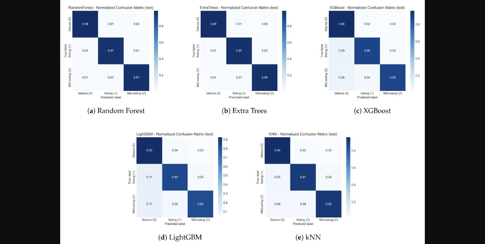

<!--
v4 · 2026-09-09
- v1: 노트 요약 기반 초안 (24장)
- v2: 랩 템플릿·1/2회차 언어로 전면 재작성 (26장)
- v3: "왜 3클래스뿐인가" 경계 분해 2장으로 확장
- v4: 한계 파트에 "고정 1.28초 토막" 문제제기 1장 추가 (28장) — 확정판 (2026-09-09)
pptx 제작은 외부 AI에 위임 — 지침은 같은 폴더 pptx-handoff.md
-->

<!-- _class: lead -->
<!-- _paginate: false -->

# 로봇은 지금이 몇 단계인지 어떻게 아는가

### Machine Learning Models for Reliable Gait Phase Detection Using Lower-Limb Wearable Sensor Data

Fiaz, Guido, Conforti · Applied Sciences, 2026

WalkAI LAB · 3회차 논문 리뷰 · **발표: 김지민**

---

# 지난 회차와 잇기

**1회차 — 관찰**
보행주기 8단계를 해부했고, 가장 중요한 두 경계가
**초기 접지(발 닿음)와 발끝 떼기(발 뜸)**라는 걸 배웠습니다.

**2회차 — 개입**
로봇이 힘을 주려면 지금이 어느 단계인지 알아야 하고,
센서 라인업과 "개인 간 일반화가 어렵다"는 현실을 배웠습니다.

**오늘 — 실전**
그 재료로 실제 분류를 해본 논문을 읽습니다.
그리고 읽다가 이상한 숫자를 발견해서, **검산까지 해봤습니다.**

리뷰는 1회차에서 정한 템플릿 순서로 갑니다:
**① 문제 → ② 데이터 → ③ 방법 → ④ 결과 → ⑤ 한계와 내 생각**

---

<!-- _class: lead -->

# ① 문제 (Why)

---

# 로봇은 타이밍을 알아야 힘을 줄 수 있다

1회차에서 배운 그대로입니다.

- 유각기에는 발목을 들어올려 발이 끌리지 않게 돕고
- 입각기에는 무릎이 꺾이지 않도록 버텨줘야 합니다

그러니까 로봇 입장에서 첫 질문은 이겁니다 —

> **"지금 환자 발이 땅에 있나, 공중에 있나?"**

이걸 센서 신호만으로 실시간으로 맞히는 게
보행 위상 인식(gait phase detection)입니다.

---

# 그런데 8단계를 다 잡을 수는 없다 — 경계를 분해해보면

7개 구간은 전부 "어떤 **사건**이 일어나면 다음 구간"으로 정의됩니다.
그 사건들을 종류별로 나누면 세 부류입니다.

| 경계 사건 | 나누는 구간 | 무엇으로 재나 |
|---|---|---|
| **내 발** 닿음 (HS) | 주기 시작 | 발 스위치 — **이진 전이, 깨끗함** |
| **내 발** 뜸 (TO) | 전유각 → 초기유각 | 발 스위치 — **이진 전이, 깨끗함** |
| 반대쪽 발 뜸 | 부하반응 → 중간입각 | **반대쪽 발**의 스위치 |
| 반대쪽 발 닿음 | 말기입각 → 전유각 | **반대쪽 발**의 스위치 |
| 몸무게가 앞발 위로 | 중간입각 → 말기입각 | 몸의 기하학 — **밖에서 봐야 함** |
| 발이 지지발 옆 통과 | 초기유각 → 중간유각 | 몸의 기하학 |
| 정강이 수직 | 중간유각 → 말기유각 | 몸의 기하학 |

---

# 그래서 3지선다가 됩니다

- **기하학 경계 3개** — 착용 센서 영역 밖. 그 정답은 VICON(실험실)이 만듭니다.
  IMU 각도는 드리프트 낀 추정치라, 추정으로 답안지를 만들면
  **오차가 정답에 섞이는 순환 문제**가 생깁니다
- **반대발 경계 2개** — 원 데이터셋엔 양다리 50채널이 다 있는데
  논문은 **오른다리만** 썼습니다. 반대발까지 쓰면 원리상 5구간도 가능했습니다.
  절반은 물리적 한계, **절반은 논문의 선택**
- **남은 건 HS/TO 둘** → 나눌 수 있는 구간은 stance / swing **2개**

| 우리가 배운 7~8단계 | 이 논문 |
|---|---|
| 입각기 5단계 전부 | **stance** |
| 유각기 (초기·말기 유각) | **swing** |
| 유각기 중 중간 유각 | **mid-swing** — 사건 없이 **시간으로 자름**(가운데 20~25%) |

물리적 사건이 없는 경계 — 뒤에서 모델이 정확히 여기서 틀립니다.

---

# 이 논문의 질문

> 공개 웨어러블 데이터셋에서, 딥러닝 없이 고전 머신러닝만으로
> stance / swing / mid-swing을 얼마나 맞힐 수 있나?

주장하는 기여는 두 가지:

1. 위상 정답(라벨)이 없는 데이터에 **자동으로 라벨을 만드는 절차**
2. 같은 조건에서 **5개 모델을 공정하게 비교**한 성적표

---

<!-- _class: lead -->

# ② 데이터 (What)

---

# 6명, 오른쪽 다리, 23채널

Zafar 공개 데이터셋(figshare). 건강 5명 + 재활 1명, 100 Hz.
2회차 4-1에서 배운 센서 라인업이 그대로 들어 있습니다.

| 센서 | 2회차에서 배운 성격 | 여기서의 역할 |
|---|---|---|
| sEMG 4근육 | 움직임보다 먼저 나온다 · 땀에 취약 | 입력 |
| IMU 2개 (허벅지·정강이) | 싸고 어디든 · 드리프트 | 입력 |
| 관절각 인코더 2개 | 로봇 엔코더와 같은 종류 | 입력 |
| 압력센서 2개 (뒤꿈치·발끝) | 접지 감지 | **정답 만들기** |
| 발 스위치 (버튼) | 눌림/떨어짐 | **정답 만들기** |

6명 — 2회차에서 배운 "웨어러블 데이터베이스는 작다"는 현실 그대로입니다.

---

# 언제나처럼, 문제는 정답이 없다는 것

2회차 6-2에서 봤던 세 가지 장벽, 기억하십니까.
노이즈 · 이상치 · 그리고 **"라벨이 부실하다"**.

머신러닝은 정답이 붙은 데이터로만 배웁니다.
그런데 센서 원신호에는 "지금이 stance다"라는 표시가 없습니다.

저자들의 주장:

> "이 데이터셋에는 위상 라벨이 없다. 그래서 우리가 만들었다."

이 문장, 뒤에서 다시 만나게 됩니다.

---

<!-- _class: lead -->

# ③ 방법 (How)

---

# 정답 만들기 — 버튼과 압력센서를 맞대본다

---

# 정답 만들기, 풀어서 설명하면

**재료 둘**: 발 스위치(디지털 버튼)와 flex 압력센서(아날로그 연속값).
같은 자리(뒤꿈치·발끝)에 둘 다 붙어 있습니다.

1. 버튼이 눌리는 순간 = HS, 떨어지는 순간 = TO — 1차 추정
2. 그런데 기계식 버튼은 튀고(바운스) 늦게 떨어집니다
3. 그래서 압력 신호를 0~1로 정규화하고,
   "어느 문턱값부터 접지로 볼까"를 0.10~0.90까지 훑으며
   **버튼 이벤트와 시간차가 가장 작은 문턱값을 자동 선택** (대개 0.2~0.4)
4. 다듬어진 HS/TO로 라벨 부여: HS→TO는 stance, TO→HS는 swing,
   swing 가운데 20~25%는 mid-swing

버튼과 압력을 서로 대조해 경계를 다듬는 절차 —
**이 부분은 실제로 다른 데이터셋에도 이식할 수 있는 부품**입니다.

---

# 신호를 1.28초 토막으로 자른다

센서는 1초에 100줄씩 숫자를 뱉습니다.
한 줄(0.01초)만 봐서는 위상을 알 수 없으니, **토막(윈도우)**을 만듭니다.

- 토막 하나 = 128줄 = 1.28초 (한 보행주기가 대충 들어가는 길이)
- 64줄씩 밀면서 자름 → **이웃 토막끼리 절반이 겹침** (이것도 기억해두십시오)
- 토막의 정답 = 그 안에서 가장 많은 위상. 위상이 섞인 경계 토막은 버림
- 모델 입력 = 128줄 × 23채널 = **2944개 숫자를 그냥 한 줄로 폄**

평균·표준편차 같은 특징 추출 없이 날 것을 폈습니다.
(서론에는 "통계 특징 40개"라 써놓고 실제로는 이렇게 했습니다 — 불일치 하나.)

---

# 다섯 모델을 같은 시험장에 넣었다

| 모델 | 성격 한 줄 |
|---|---|
| Random Forest | 나무 여러 그루를 각자 키워 다수결 |
| Extra Trees | RF보다 나무를 더 아무렇게나 키움 (그게 오히려 잘됨) |
| XGBoost | 앞 나무의 실수를 다음 나무가 보완 (부스팅) |
| LightGBM | 부스팅의 속도 개선판 |
| kNN | 학습 없음 — 비슷한 토막을 찾아 따라 말하기 |

같은 데이터, 같은 전처리, 같은 평가 —
성능 차이를 모델 탓으로만 돌릴 수 있게 통제한 것이 이 논문의 장점입니다.

---

<!-- _class: lead -->

# ④ 결과

---

# 성적표

| 모델 | 정확도 | MCC | 학습 시간 |
|------|-----|-----|---------|
| **Extra Trees** | **97.9%** | **0.968** | 482초 |
| Random Forest | 97.7% | 0.965 | 1410초 |
| kNN | 93.2% | 0.896 | **12.8초** |
| XGBoost | 91.3% | 0.867 | 435초 |
| LightGBM | 87.3% | 0.805 | 232초 |

- 나무 다수결(배깅) > kNN > 부스팅. 10-fold 교차검증도 같은 순위
- kNN은 정확도를 5%p 내주고 시간을 40분의 1로 — 엣지 장비라면 고려할 만함

---

# 어디서 틀렸나 — 혼동행렬

부스팅의 오답은 대부분 "**공중인데 땅이라고 답함**"(swing→stance 0.09~0.11).
본문은 "swing↔mid-swing 혼동이 최대"라고 썼지만, 그림 수치와 다릅니다.

---

<!-- _class: lead -->

# ⑤ 한계와 내 생각

## 여기부터가 오늘 발표의 본론입니다

---

# 97.9%를 믿으면 안 되는 이유 — 시험 문제 유출

train/test를 **토막 단위로 무작위로 섞어** 나눴습니다. 그런데:

- 이웃 토막은 **절반이 겹칩니다** → 시험 문제의 절반을 연습 때 이미 봄
- **같은 사람**의 걸음이 연습과 시험 양쪽에 다 들어감

2회차 5-4의 그 문장 — "개인 간 일반화가 어렵다" —
이 논문은 그 어려운 문제를 **아예 풀지 않았습니다.**
새 환자에게 채웠을 때 어떻게 되는지, 이 논문으로는 알 수 없습니다.

저자들도 정직하게 적었습니다: 이 수치는 **"upper performance bound"**.
이 조건이면 어느 나무 모델이든 97%가 나옵니다.

---

# 하나 더 — 1.28초 고정 토막과 걷는 속도

토막 길이 1.28초의 근거를 물으면 답이 궁색해집니다.

- "한 보행주기가 들어가는 길이" — 성인 평균 1.0~1.2초 기준. 그럴듯하지만
- 실은 **128 = 2⁷** — 신호처리 관습으로 고른 숫자에 가깝고
- 64나 256과 비교한 실험(ablation)은 **없습니다**

더 근본적인 문제 — 2회차 5-1에서 배운 그대로,

> **"정상 보행은 하나가 아니다."**

천천히 걷는 사람은 주기가 1.5초를 넘습니다. 고정 1.28초 토막에는
한 걸음이 다 안 들어갑니다. 이 데이터셋의 **재활 환자(UP112)**가
바로 그럴 사람이죠. 고정 길이 윈도우는 건강한 5명 기준의 선택이고,
속도가 다른 새 환자에게 일반화가 안 되는 또 하나의 이유입니다.

---

# 그래서 검산해봤습니다 ① — 윈도우 수가 안 맞는다

논문이 준 숫자만으로 계산할 수 있습니다.

- 전체 샘플 433,932줄 (100 Hz ≈ 72분)
- 128줄 토막을 64줄씩 밀며 자르면 → 약 **6,780개**가 나와야 함
- 그런데 결과 표(Table 6)의 총 윈도우 수 = **433,932. 샘플 수와 동일. 64배 차이**

이 숫자가 맞으려면 토막을 1줄씩 밀어야 하고(겹침 99.2%),
그러면 시험 문제 유출은 본문 서술(50%)보다 훨씬 심해집니다.

> 어느 쪽이 사실이든 — **방법 서술과 결과 표가 서로 모순입니다.**

---

# 검산 ② — 원 데이터셋에 정답이 이미 있었다

figshare 원본의 공식 설명서를 직접 열어봤습니다.

- 보행 이벤트(HS/TO) **인덱스 열이 이미 있음**
- 위상 코드 정의: **1=Stance, 2=Swing, 3=Mid-swing**
- flex vs 발스위치 시간차 분석표까지 데이터셋 문서에 포함

아까 그 문장 — "라벨이 없어서 우리가 만들었다" — **설명서와 어긋납니다.**
mid-swing이라는 특이한 3분류 자체가 원 데이터셋에서 온 것으로 보입니다.
핵심 기여의 새로움이 프레이밍보다 작아집니다.

---

# 검산 ③ — 못 한 것도 말씀드리면

- 원본 데이터 2GB를 받아 실측 재계산하는 것은 회선 속도 때문에 발표 전에 못 했습니다
- 설명서의 라벨 열이 실제로는 부실할 가능성은 남아 있습니다
  — 그렇다면 논문의 라벨 재생성이 정당화될 여지도 있습니다

지금 확정할 수 있는 것과 아닌 것:

| 판정 | 근거 |
|---|---|
| ✅ 윈도우 수 모순 | 논문 내부 숫자만으로 성립 |
| ✅ 라벨 체계 기존재 | 데이터셋 공식 문서 |
| ⏳ 라벨 열의 실제 품질 | 원본 실측 필요 — 열린 의문 |

---

# 그래도 가져갈 부품은 있다

- **버튼+압력 대조로 HS/TO를 다듬는 절차** — 발 스위치 있는 데이터면 이식 가능
- **이 데이터셋 자체** — sEMG+IMU+관절각+압력이 동기화된 공개셋
- 불균형 데이터에서 정확도 대신 **MCC를 주지표로** 쓰는 관행

그리고 교훈 하나 —

> 논문을 읽는 것과 논문을 **검산하는 것**은 다른 작업이다.
> 검산해보니 발표할 거리가 두 배가 됐다.

---

# 스터디 로드맵에서 오늘의 위치

| 주차 | 내용 |
|------|------|
| 1주차 | Kong & Tomizuka — HMM 고전 |
| **2주차** | **오늘: Fiaz et al. 비판적 리뷰** |
| 3주차 | Young & Hargrove 2016 등 — subject-independent 설계 |
| 4주차 | 재활 로봇·임상 확장 |
| 5주차 | **Camargo 2021 (22명) 데이터셋 자체 실험** |

5주차 실습 제안 두 가지:

1. subject 단위 분할 vs 토막 단위 분할 — **시험 문제 유출이 성능을 얼마나 부풀리는지** 직접 측정
2. 실습 설계에 **"논문 수치 검산" 단계 추가** — 오늘 발견은 산수만으로 나왔습니다

---

# 정리

- 로봇이 힘을 줄 타이밍 = 보행 위상. 센서가 확실히 아는 경계는 HS/TO뿐이라
  이 논문은 3클래스로 문제를 줄였다
- 버튼+압력 대조로 정답을 만들고, 1.28초 토막으로 잘라, 고전 ML 5종 비교
  — Extra Trees 97.9%
- 하지만 그 숫자는 시험 문제 유출(겹침+같은 사람) 위의 상한선이다
- 검산 결과: 윈도우 수는 논문 안에서 모순이고, 원 데이터셋에는 라벨이 이미 있었다
- 다음 질문은 하나 — **"새 사람에게 채우면 몇 %인가?"** 5주차에 직접 재봅시다

---

<!-- _class: lead -->

# Q&A

감사합니다

원문: doi.org/10.3390/app16031397
노트·해설·검산: github.com/sokcho-kim/sudo-read-paper

<!--
변환:
  npx @marp-team/marp-cli --allow-local-files papers/2026-08-25-gait-phase-detection/slides.md -o papers/2026-08-25-gait-phase-detection/slides.pptx
-->
